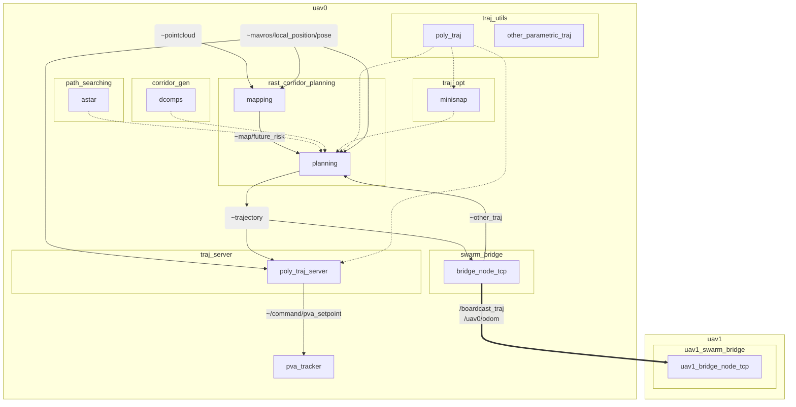
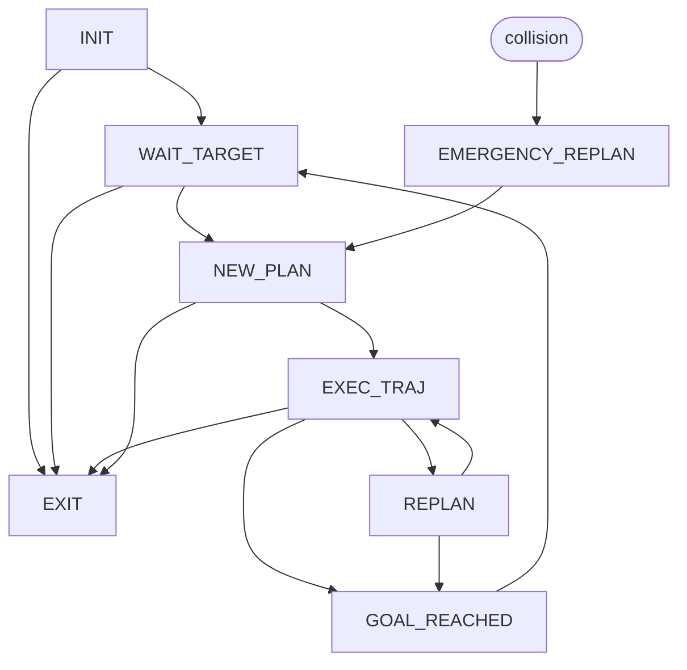

# M-RAST: a multi-agent quadrotor planning framework with risk-aware spatial-temporal corridors

[toc]

## Introduction

**M-RAST** is a multi-agent quadrotor planning framework with risk-aware spatial-temporal safety corridors. This project is based on [RAST](https://github.com/g-ch/RAST_corridor_planning), which is a risk-aware motion planning algorithm with safety guarantees in dynamic uncertain environments.


## Installation

__Tested environment__: Ubuntu 18.04 + ROS Melodic and Ubuntu 20.04 + ROS Noetic

To compile the source code, you need:
1. PCL, mavros, Eigen. PCL and Eigen are included in the desktop-full version of ROS. The mavros package is only used for ROS message subscriptions. If it's not installed on your laptop, check [mavros](https://github.com/mavlink/mavros) for installation guidance.

2. Install [munkers-cpp](https://github.com/saebyn/munkres-cpp) with the following steps.
    ```shell
    git clone https://github.com/saebyn/munkres-cpp.git
    cd munkres-cpp
    mkdir build && cd build
    cmake ..
    make
    sudo make install
    ```
    
3. Install [OSQP](https://github.com/osqp/osqp), which is a lightweight QP solver. You can follow these [installation guidelines](https://osqp.org/docs/get_started/sources.html#build-the-binaries).
    ```shell
    git clone --recursive https://github.com/osqp/osqp
    cd osqp
    mkdir build && cd build
    cmake -G "Unix Makefiles" ..
    cmake --build .
    sudo cmake --build . --target install
    ```

4. Create a ROS workspace
   
   ```shell
   mkdir -p catkin_ws/src
   cd catkin_ws/src
   ```
   
4. Clone the simulator from [GitHub](https://github.com/edmundwsy/uav_simulator).
   
   ```shell
   git clone --recursive https://github.com/edmundwsy/uav_simulator.git
   ```
   
4. Clone the code in the ROS workspace, update the submodule, and compile.
   
   ```shell
   git clone https://github.com/edmundwsy/multi-agent-rast.git
   cd multi-agent-rast
   git submodule init & git submodule update
   cd ../..
   catkin build
   ```


## Structure

* [RAST_corridor_planning/](./RAST_corridor_planning): RAST corridor generation and planning for single uav
* [path_searching/](./path_searching): path finding library (dynamic A star and Conflict-based Search)
* [plan_env/](./plan_env): mapping library (only grid map now, we can use DSP map in `rast_corridor_planning` to replace this package)
* [swarm_bridge/](./swarm_bridge): package for multi-robot trajectory communication via [ZeroMQ](https://zeromq.org/), which increases the communication stability and makes it distributed.
* [traj_opt/](./traj_opt): package for trajectory optimization. [GCOPTER](https://github.com/ZJU-FAST-Lab/GCOPTER) is already included. 
* [traj_utils/](./traj_utils): package contains trajectory visualization class and parametric trajectory message.
* [traj_server/](./traj_server): package for discretize parametric trajectory into separate waypoints and poses. 
* [.gitignore](./.gitignore)
* [.gitmodules](./.gitmodules)
* [README.md](./README.md)

### RQT Graph

- **dotted line** represents introduced as a library (by class & class pointer)
- **solid line** represents ros message
- each **subgraph** represents a individual package with its own test samples. Main functionalities should be encapsulated in `.h` or `.hpp` files.

- `~trajectory`: parametric trajectory message
- `~other_traj`: parametric trajectory message related to other agents
- `~/command/pva_setpoint`: discretized trajectory messages




### [rast_corridor_planning]: Main Planning Package
Risk-aware map building, corridor generation and planning package for single uav.

Features including

- DSP Map
- Risk-aware A star path searching
- finite state machine
- call safety corridor generation functions
- call trajectory optimization functions

#### Finite State Machine (FSM)

| Current State     | Status                                                       | Next State                             |
| ----------------- | ------------------------------------------------------------ | -------------------------------------- |
| INIT              | Wait for input information                                   | WAIT_TARGET                            |
| WAIT_TARGET       | Wait for risk map, odometry and global goal. If risk map and odometry is not updating, switch to this state. | NEW_PLAN                               |
| NEW_PLAN          | Plan a new trajectory from stationary state, then switch to executing state. | EXEC_TRAJ, WAIT_TARGET                 |
| EXEC_TRAJ         | Execute current trajectory, check the global planning progress and the total risk. | REPLAN, EMERGENCY_REPLAN, GOAL_REACHED |
| REPLAN            | Replan the trajectory from last state of the trajectory.     | EXEC_TRAJ, GOAL_REACHED                |
| EMERGENCY_REPLALN | Replan a trajectory from current state and velocity. If safety mode is enabled (too close to the people) | NEW_PLAN, EXEC_TRAJ                    |
| GOAL_REACHED      | Drone reached the goal, wait new goal from the goal queue.   | WAIT_TARGET                            |
| EXIT              | Exit the FSM                                                 |                                        |

state diagram is shown as follows



### [traj_utils]: Trajectory utilities

A library for parametric trajectories message and related visualization. 

### [traj_opt]: Trajectory optimizer

**Dependency**: `traj_utils`

A library for trajectory optimization, which includes polynomial ✅, bernstein 📝, bspline 📝, MINCO ✅ trajectories and related optimization algorithms. Trajectory optimizations are recommended to implement as a library, and a self-contained ROS node should be included for test.

### [traj_server]: Trajectory server

**Dependency**: `traj_utils`

A node for discretize parametric trajectory into separate waypoints and poses.

- Input: parametric trajectory message (`~trajectory`)
- Output: discretized trajectory message (`~position_cmd`, `~pva_setpoint`, `/traj_start_trigger`)
- Note: `/traj_start_trigger` is a `geometry_msgs::PoseStamped` message, which is used to trigger the discretization and trajectory execution.
- Note: There are two behavior of trajectory queue, one is adding new trajectory to the end of the queue, and the other is clearing the queue and adding new trajectory. We use the stating time of the incoming trajectory and the end time of the previous trajectory to decide which behavior is used. 
  - if t_start >= t_end, then add new trajectory to the end of the queue
  - if t_start < t_end, then clear the queue and add new trajectory 


### RVIZ Simulation


### Gazebo Simulation


## Quick Start

### Test in RVIZ simulation 

```shell
source devel/setup.bash
roslaunch rast_corridor_planning sim_planning_dyn.launch
```


### Test in Gazebo simulation


## Future Work

- [x] (Aug. w1) Refactor the code in `rast_corridor_planning` to make it fit this framework. Extract `traj_server` from `planning`.
- [x] (Aug. w1) Merge MiniSnap trajectory optimization `corridor_minisnap` to `traj_opt`
- [x] (Aug. w3) Move trajectory queue to `traj_server`
- [x] (Aug. w3) Test tracking error: (x: max 0.5, avg 0.2)
- [x] (Aug. w3) Add `drone_id` to the planner class
- [x] (Aug. w3) Refine visualizations
- [x] (Aug. w3) Work with Moji on the fake simulation
- [ ] (Aug. w4) Include B-Spline trajectory optimization to `traj_opt` 
- [x] (Aug. w4) Include `decomp_ros` for convex corridor generation


## ROS Style

### ROS Launch

In this project, the  `<group>` tag is used to make it easier to apply setting to a single agent. Each agent is assigned to a independent namespace where all topics are published with the group name prefix. This design is to avoid mutual communication in simulation environment.

Use `.launch` file to start a group of nodes for each uav.
```xml
  <group ns="uav$(arg drone_id)">
    <node pkg="rast_corridor_planning" name="mapping" type="mapping" output="screen">
      <rosparam file="$(find rast_corridor_planning)/config/cfg.yaml" command="load" />
      <remap from="/camera_front/depth/points" to="/uav$(arg drone_id)/pcl_render_node/cloud" />
    </node>
  </group>
```

In C++ code, use common topic name, e.g. `~trajectory`. In launch file, remap common topic name to specific uav e.g. `/uav$(arg drone_id)/trajectory`.

### Coding Styles
Visualization and configuration should be separate class due to [Model-View-Controller architecture](https://en.wikipedia.org/wiki/Model%E2%80%93view%E2%80%93controller).

#### Configuration

Parameter should be saved in `.yaml` format under `./config` folder.
Load parameter by creating a structure named config, which load parameters from ros parameter server.
```c++
struct Config
{
    std::string mapTopic;
    std::string targetTopic;
    double dilateRadius;
    double voxelWidth;
    std::vector<double> mapBound;

    Config(const ros::NodeHandle &nh_priv)
    {
        nh_priv.getParam("MapTopic", mapTopic);
        nh_priv.getParam("TargetTopic", targetTopic);
        nh_priv.getParam("DilateRadius", dilateRadius);
        nh_priv.getParam("VoxelWidth", voxelWidth);
        nh_priv.getParam("MapBound", mapBound);
    }
};
```

#### Visualization

Visualization should be a separate class which converts variables to pre-defined `visualization_msgs::Marker` or `visualization_msgs::MarkerArray` message.
```c++
class Visualizer {
 private:
  ros::NodeHandle _nh;
  ros::Publisher  _corridor_pub;
  ros::Publisher  _colorful_traj_pub;
  ros::Publisher  _astar_path_pub;
  ros::Publisher  _start_goal_pub;
  std::string     _frame_id;

 public:
  Visualizer(ros::NodeHandle& nh, std::string& frame_id) : _nh(nh), _frame_id(frame_id) {
    _corridor_pub      = _nh.advertise<visualization_msgs::MarkerArray>("vis_corridor", 1);
    _colorful_traj_pub = _nh.advertise<visualization_msgs::MarkerArray>("vis_color_traj", 1);
    _astar_path_pub    = _nh.advertise<visualization_msgs::Marker>("vis_astar_path", 1);
    _start_goal_pub    = _nh.advertise<visualization_msgs::Marker>("vis_start_goal", 1);
  }
  ~Visualizer() {}
  typedef std::shared_ptr<Visualizer> Ptr;
  inline void visualizeTrajectory(const Eigen::Vector3d&      start_pos,
                                  const traj_opt::Trajectory& traj,
                                  double                      max_vel);
  void visualizeCorridors(std::vector<Corridor*>&     corridors,
                          geometry_msgs::PoseStamped& map_pose,
                          bool                        rviz_map_center_locked,
                          bool                        clear_corridors = false);
};
```

`std::shared_ptr` is recommended for better memory management.


## License

MIT License


## Reference

[1] X. Zhou, J. Zhu, H. Zhou, C. Xu, and F. Gao, “EGO-Swarm: A Fully Autonomous and Decentralized Quadrotor Swarm System in Cluttered Environments,” in *2021 IEEE International Conference on Robotics and Automation (ICRA)*, May 2021, pp. 4101–4107. doi: [10.1109/ICRA48506.2021.9561902](https://doi.org/10.1109/ICRA48506.2021.9561902).

[2] J. Hou, X. Zhou, Z. Gan, and F. Gao, “Enhanced Decentralized Autonomous Aerial Swarm with Group Planning.” arXiv, Mar. 02, 2022. Accessed: Jun. 29, 2022. [Online]. Available: http://arxiv.org/abs/2203.01069

[3] B. Zhou, F. Gao, L. Wang, C. Liu, and S. Shen, “Robust and Efficient Quadrotor Trajectory Generation for Fast Autonomous Flight,” *IEEE Robotics and Automation Letters*, vol. 4, no. 4, pp. 3529–3536, Oct. 2019, doi: [10.1109/LRA.2019.2927938](https://doi.org/10.1109/LRA.2019.2927938).

[4] F. Gao, L. Wang, B. Zhou, X. Zhou, J. Pan, and S. Shen, “Teach-Repeat-Replan: A Complete and Robust System for Aggressive Flight in Complex Environments,” *IEEE Transactions on Robotics*, vol. 36, no. 5, pp. 1526–1545, 2020, doi: [10.1109/TRO.2020.2993215](https://doi.org/10.1109/TRO.2020.2993215).

[5] G. Chen, W. Dong, P. Peng, J. Alonso-Mora, and X. Zhu, “Continuous Occupancy Mapping in Dynamic Environments Using Particles.” arXiv, Feb. 13, 2022. doi: [10.48550/arXiv.2202.06273](https://doi.org/10.48550/arXiv.2202.06273).
