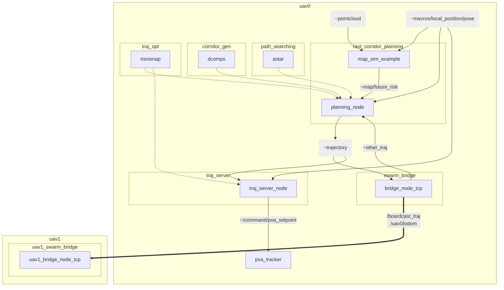

# [M]()-RAST: multi-robot risk-aware spatial-temporal corridors for uav navigation


## File Structure

* [RAST_corridor_planning/](./RAST_corridor_planning): RAST corridor generation and planning for single uav
* [path_searching/](./path_searching): path finding library (dynamic A star and Conflict-based Search)
* [plan_env/](./plan_env): mapping library (only grid map now, we can use DSP map in `rast_corridor_planning` to replace this package)
* [swarm_bridge/](./swarm_bridge): package for multi-robot trajectory communication via [ZeroMQ](https://zeromq.org/), which increases the communication stability and makes it distributed.
* [traj_opt/](./traj_opt): package for trajectory optimization. [GCOPTER](https://github.com/ZJU-FAST-Lab/GCOPTER) is already included. 
* [traj_utils/](./traj_utils): package contains trajectory visualization class and parametric trajectory message.
* [traj_server/](./traj_server): package for discretize parametric trajectory into separate waypoints and poses. 
* [.gitignore](./.gitignore)
* [.gitmodules](./.gitmodules)
* [README.md](./README.md)

## Mermaid Graph

dotted line: introduced as a library (by class & class pointer)
solid line: ros message

- `~trajectory`: parametric trajectory message
- `~other_traj`: parametric trajectory message related to other agents

Subgraph: individual package with its own test samples. Main functionalities are encapsulated in `.h` or `.hpp` files.



## Structure

### [traj_utils]: Trajectory utilities

A library for trajectory visualization and parametric trajectory message.

### [traj_opt]: Trajectory optimizer

**Dependency**: `traj_utils`

A library for trajectory optimization, which includes polynomial, bernstein, bspline trajectories and related optimization algorithms.

### [traj_server]: Trajectory server

**Dependency**: `traj_utils`

A node for discretize parametric trajectory into separate waypoints and poses.

- Input: parametric trajectory message (`~trajectory`)
- Output: discretized trajectory message (`~position_cmd`, `~pva_setpoint`)

<!-- No commit, only discuss in zoom meeting -->
## Discuss
- Good architecture for multi-robot navigation?
- What if we communicate by **safety corridors**?
- !!!WARNING: No convergence proofs of this pipeline!!!

## TODO
- [x] (Aug. w1) Refactor the code in `rast_corridor_planning` to make it fit this framework. Extract `traj_server` from `planning_node`.
- [x] (Aug. w1) Merge MiniSnap trajectory optimization `corridor_minisnap` to `traj_opt`
- [ ] (Aug. w1) Move trajectory queue to `traj_server`
- [ ] (Aug. w2) Include B-Spline trajectory optimization to `traj_opt` 
- [ ] (Aug. w3) Include `decomp_ros` for convex corridor generation
- [ ] Implement conflict-based search (CBS) method to `path_searching`


## Note

### ROS Launch
Use `.launch` file to start a group of nodes for each uav.
```xml
  <group ns="uav$(arg drone_id)">
    <node pkg="rast_corridor_planning" name="map_sim_example" type="map_sim_example" output="screen">
      <rosparam file="$(find rast_corridor_planning)/config/cfg.yaml" command="load" />
      <remap from="/camera_front/depth/points" to="/uav$(arg drone_id)/pcl_render_node/cloud" />
    </node>
  </group>
```

In C++ code, use common topic name, e.g. `~trajectory`. In launch file, remap common topic name to specific uav e.g. `/uav$(arg drone_id)/trajectory`.

### Coding Styles
Visualization and configuration should be separate class due to [Model-View-Controller architecture](https://en.wikipedia.org/wiki/Model%E2%80%93view%E2%80%93controller).

#### Configuration

Parameter should be saved in `.yaml` format under `./config` folder.
Load parameter by creating a structure named config, which load parameters from ros parameter server.
```c++
struct Config
{
    std::string mapTopic;
    std::string targetTopic;
    double dilateRadius;
    double voxelWidth;
    std::vector<double> mapBound;

    Config(const ros::NodeHandle &nh_priv)
    {
        nh_priv.getParam("MapTopic", mapTopic);
        nh_priv.getParam("TargetTopic", targetTopic);
        nh_priv.getParam("DilateRadius", dilateRadius);
        nh_priv.getParam("VoxelWidth", voxelWidth);
        nh_priv.getParam("MapBound", mapBound);
    }
};
```

#### Visualization

Visualization should be a separate class which converts variables to pre-defined `visualization_msgs::Marker` or `visualization_msgs::MarkerArray` message.
```c++
class Visualizer {
 private:
  ros::NodeHandle _nh;
  ros::Publisher  _corridor_pub;
  ros::Publisher  _colorful_traj_pub;
  ros::Publisher  _astar_path_pub;
  ros::Publisher  _start_goal_pub;
  std::string     _frame_id;

 public:
  Visualizer(ros::NodeHandle& nh, std::string& frame_id) : _nh(nh), _frame_id(frame_id) {
    _corridor_pub      = _nh.advertise<visualization_msgs::MarkerArray>("vis_corridor", 1);
    _colorful_traj_pub = _nh.advertise<visualization_msgs::MarkerArray>("vis_color_traj", 1);
    _astar_path_pub    = _nh.advertise<visualization_msgs::Marker>("vis_astar_path", 1);
    _start_goal_pub    = _nh.advertise<visualization_msgs::Marker>("vis_start_goal", 1);
  }
  ~Visualizer() {}
  typedef std::shared_ptr<Visualizer> Ptr;
  inline void visualizeTrajectory(const Eigen::Vector3d&      start_pos,
                                  const traj_opt::Trajectory& traj,
                                  double                      max_vel);
  void visualizeCorridors(std::vector<Corridor*>&     corridors,
                          geometry_msgs::PoseStamped& map_pose,
                          bool                        rviz_map_center_locked,
                          bool                        clear_corridors = false);
};
```
