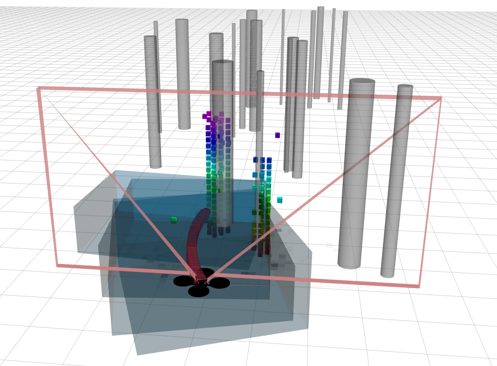
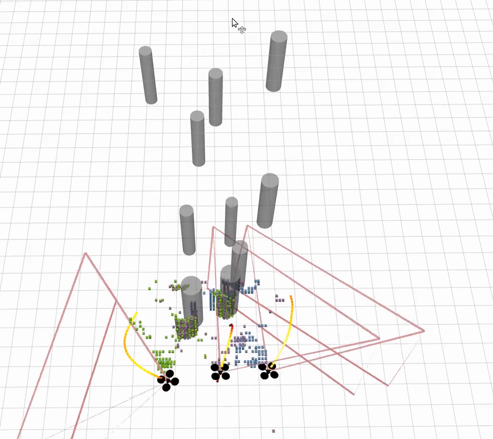
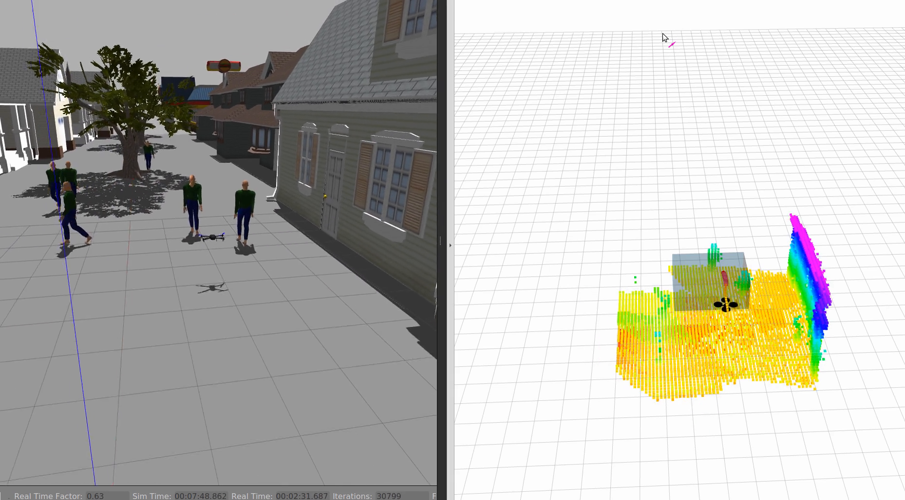
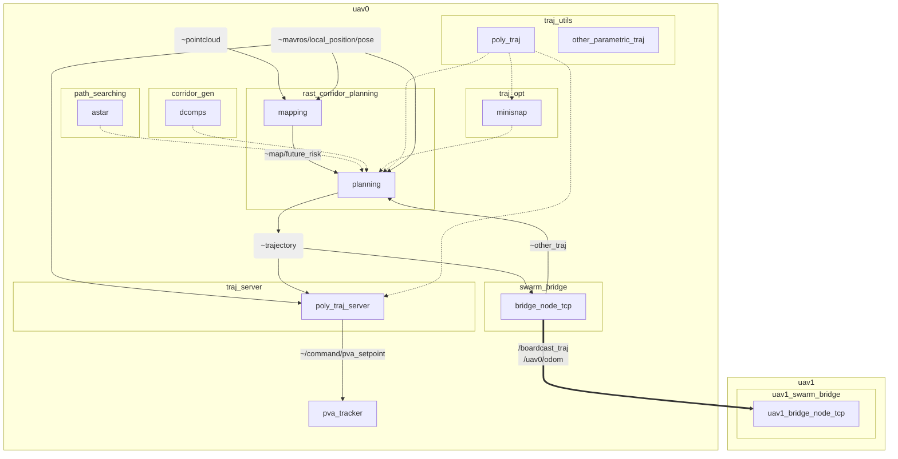
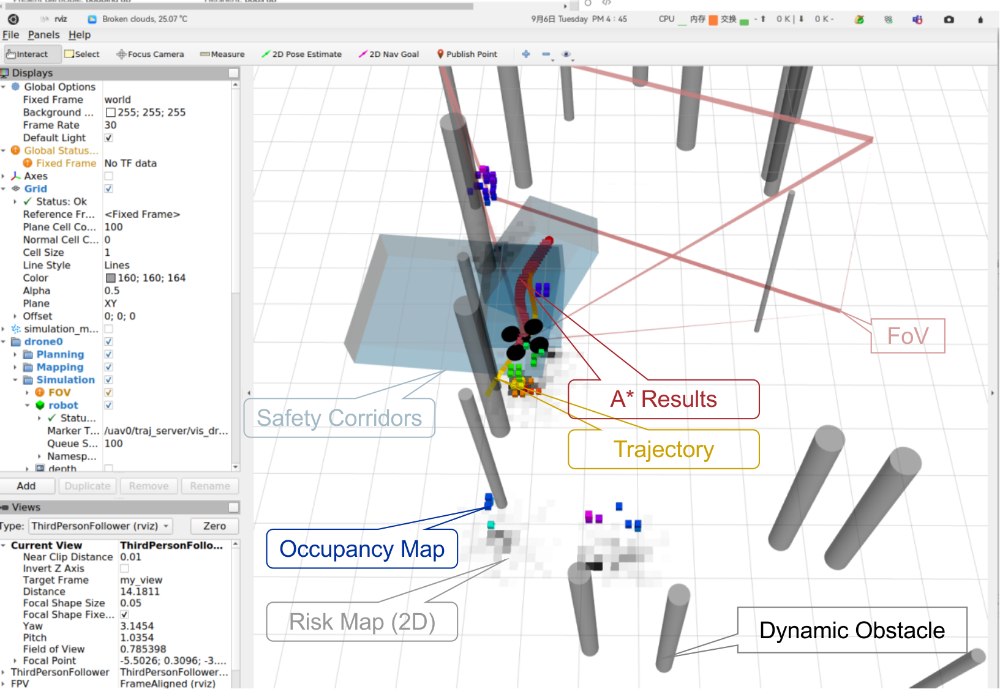

# M-RAST: a multi-agent quadrotor planning framework with risk-aware spatial-temporal corridors

**Table of Contents**

[toc]


## Introduction

**M-RAST** is a multi-agent quadrotor planning framework with risk-aware spatial-temporal safety corridors. This project is based on [RAST](https://github.com/g-ch/RAST_corridor_planning), which is a risk-aware motion planning algorithm with safety guarantees in dynamic uncertain environments. This framework is written in C++ and ROS.


## Installation

__Tested environment__: Ubuntu 20.04 + ROS Noetic

**Requirements:** Ubuntu 16.04, 18.04, or 20.04 with `ros-<your_distribution>-desktop-full` installation

To compile the source code, you need:

1. PCL, `mavros`, Eigen. 
    PCL and Eigen are included in the desktop-full version of ROS. The `mavros` package is only used for ROS message subscriptions. Install `mavros` by following command

    ```shell
    sudo apt install ros-<your_distribution>-mavros ros-<your_distribution>-mavros-msgs
    ```
    
2. Install [munkers-cpp](https://github.com/saebyn/munkres-cpp) with the following steps.
   
    ```shell
    git clone https://github.com/saebyn/munkres-cpp.git
    cd munkres-cpp
    mkdir build && cd build
    cmake ..
    make
    sudo make install
    ```
    
3. Install [OSQP](https://github.com/osqp/osqp), which is a lightweight QP solver. You can follow these [installation guidelines](https://osqp.org/docs/get_started/sources.html#build-the-binaries).
    ```shell
    git clone --recursive https://github.com/osqp/osqp
    cd osqp
    mkdir build && cd build
    cmake -G "Unix Makefiles" ..
    cmake --build .
    sudo cmake --build . --target install
    ```

4. Install `zmqpp` for mutual communication, which provides utilities for multi-robot trajectory communication via a high-speed protocal [ZeroMQ](https://zeromq.org/)
   
   ```shell
   sudo apt install libzmqpp-dev
   ```
   
5. Create a ROS workspace

   ```shell
   mkdir -p catkin_ws/src
   cd catkin_ws/src
   ```

6. Clone [mav_comm](https://github.com/ethz-asl/mav_comm) package. It contains message and service definitions used for mavs. 

   ```shell
   git clone https://github.com/ethz-asl/mav_comm.git
   ```

   

6. Clone the simulator from [GitHub](https://github.com/edmundwsy/uav_simulator). This repository provides a lightweight simulation and visualization environment for MAV system based on a [open-source project](https://github.com/HKUST-Aerial-Robotics/Fast-Planner). In our project, we only use the mapping, localization modules and ROS message. We will use it as a "fake" simulator, which means we only consider **ideal** mapping, localization and planning without any real physics and disturbance.

   ```shell
   git clone --recursive https://github.com/edmundwsy/uav_simulator.git
   ```

7. Clone the code in the ROS workspace, update the submodules, and compile.

   ```shell
   git clone https://github.com/edmundwsy/multi-agent-rast.git
   cd multi-agent-rast
   git submodule init & git submodule update
   cd ../..
   catkin build
   ```

## Quick Start

### RViz simulation 

The RViz simulation is a fake simulation without physical contact and disturbance. It can simply debug the code and visualize the planning algorithm, which is vital for early-stage development. Before starting, you need to go to your workspace directory and source the setup script

```shell
cd catkin_ws
source devel/setup.bash
```

If you would like to test the algorithm in single agent dynamic environment, you can run following command:

```shell
roslaunch rast_corridor_planning sim_planning_dyn.launch
```

It will launch all ROS nodes for single agent planning and start a RViz window to visualize environment and trajectory. 



You can also launch multi-agent path planning similarly

```shell
roslaunch rast_corridor_planning sim_multi_dyn.launch
```

The RViz simulation will display three agents in a dynamic environment. You can send a trigger by `rosrun traj_server trigger ` or use the `2D Nav Goal` tool in `RViz`to start planning.




### Gazebo Simulation & Real-World Test

If you would like to test this system in Gazebo simulation and real world, here are the instructions

1. Install [PX4-Autopilot](https://github.com/PX4/PX4-Autopilot). PX4 is a professional open-source autopilot supported by an active world wide community. You can either follow the [installation manual](https://docs.px4.io/v1.12/en/simulation/multi_vehicle_simulation_gazebo.html) or copy following commands:

   ```shell
   git clone https://github.com/PX4/PX4-Autopilot.git
   git submodule update --init --recursive
   make px4_sitl_default gazebo
   ```
   
2. Clone `pva_tracker` to your workspace.    `pva_tracker` receives position, velocity, acceleration and yaw command from the planner and commands to attitude and thrust setpoints which will be read by PX4 firmware. 

   ```
   cd catkin_ws/src
   git clone https://github.com/g-ch/pva_tracker.git
   cd ..
   catkin build
   ```

   

3. Next you can source the environment by

   ```shell
   source Tools/setup_gazebo.bash $(pwd) $(pwd)/build/px4_sitl_default
   export ROS_PACKAGE_PATH=$ROS_PACKAGE_PATH:$(pwd):$(pwd)/Tools/sitl_gazebo
   ```

   then change directory back to the workspace and launch the simulation

   ```shell
   cd catkin_ws
   source devel/setup.bash
   roslaunch rast_corridor_planning street.launch
   ```

4. In an separate terminal you can start `mavros` by

   ```shell
   source devel/setup.bash
   roslaunch rast_corridor_planning mavros.launch
   ```

5. Then open another separate terminal, type following commands to launch `pva_tracker`

   ```shell
   source devel/setup.bash
   rosrun pva_tracker tracker_sim_auto_arm_takeoff
   ```

6. Next open another separate terminal and launch all the planning nodes

   ```shell
   source devel/setup.bash
   roslaunch rast_corridor_planning gazebo_planning.launch
   ```

7. All agents start planning after receiving a trigger, you can either send the trigger via use commands or use the `2D Nav Goal` tool in `RViz`. Agents will not use triggered position in the initial plan. When agents reach the initial goal you can send a new goal in the same way.




## Project Structure

The structure of this framework is as follows:

* [RAST_corridor_planning/](./RAST_corridor_planning): RAST corridor generation and planning for single MAV
* [path_searching/](./path_searching): path finding library (E.g. hybrid A star [1] [3] and Conflict-based Search [2])
* [plan_env/](./plan_env): mapping library (only grid map now, we can use DSP map in `rast_corridor_planning` to replace this package)
* [swarm_bridge/](./swarm_bridge): package for multi-robot trajectory communication via [ZeroMQ](https://zeromq.org/), which increases the communication stability and makes it distributed easier.
* [traj_opt/](./traj_opt): package for trajectory optimization including state-of-the-art trajectory optimization algorithms ([GCOPTER](https://github.com/ZJU-FAST-Lab/GCOPTER) [5], Minimum Snap)
* [traj_utils/](./traj_utils): package contains parametric trajectory definition and related ROS message. A general-purpose trajectory visualization class is also implemented.
* [traj_server/](./traj_server): package for discretize parametric trajectory into separate waypoints and poses. 
* [.gitignore](./.gitignore)
* [.gitmodules](./.gitmodules)
* [README.md](./README.md)


### RQT Graph

The communication relationship among packages can be seen in the following RQT graph. It also visualizes the data flow in these packages. The pointcloud data from depth camera and odometry data from IMU are subscribed by the `mapping` node, in which the future risk map is generated. Then the planning node reads the risk map and trajectory from other agents, outputs the collision-free parametric trajectories. It imports self-contained libraries such as `path_searching`,  `corridor_gen` and `traj_opt`. Then the parametric trajectory is sent to `swarm_bridge` package and boardcasts to all agents in this environment. The trajectory topic is also subscribed by `traj_server` topic in which it is converted to discreted position, velocity and acceleration setpoints for flight control.

Notations in the RQT graph are

- dotted line represents introduced as a library (by class & class pointer)
- solid line represents communication via ros message
- large yellow box represents namespace
- each subgraph inside the large box represents a individual package with its own test samples. Main functionalities should be encapsulated in `.h` or `.hpp` files.
- The communication of cooperative agents is relied on trajectory boardcasting via `/boardcast_traj`



#### ROS messages

Here are important ROS messages in the framework. 

- `~pointcloud`: point cloud message from depth camera
- `~mavros/local_position/pose`: local odometry message from onboard IMU or motion capture system
- `~trajectory`: parametric trajectory message
- `~other_traj`: parametric trajectory message related to other agents
- `~/command/pva_setpoint`: discretized trajectory messages to controller
- `/boardcast_traj`: multi-agent communication


### [rast_corridor_planning]: Main Planning Package
This package is the main package for risk map building, corridor generation and motion planning, including

- DSP Map [4]
- Risk-aware A star path searching
- finite state machine
- call safety corridor generation functions
- call trajectory optimization functions

#### Finite State Machine (FSM)

| Current State     | Status                                                       | Next State                             |
| ----------------- | ------------------------------------------------------------ | -------------------------------------- |
| INIT              | Wait for input information                                   | WAIT_TARGET                            |
| WAIT_TARGET       | Wait for risk map, odometry and global goal. If risk map and odometry is not updating, switch to this state. | NEW_PLAN                               |
| NEW_PLAN          | Plan a new trajectory from stationary state, then switch to executing state. | EXEC_TRAJ, WAIT_TARGET                 |
| EXEC_TRAJ         | Execute current trajectory, check the global planning progress and the total risk. | REPLAN, EMERGENCY_REPLAN, GOAL_REACHED |
| REPLAN            | Replan the trajectory from last state of the trajectory.     | EXEC_TRAJ, GOAL_REACHED                |
| EMERGENCY_REPLALN | Replan a trajectory from current state and velocity. If safety mode is enabled (too close to the people) | NEW_PLAN, EXEC_TRAJ                    |
| GOAL_REACHED      | Drone reached the goal, wait new goal from the goal queue.   | WAIT_TARGET                            |
| EXIT              | Exit the FSM                                                 |                                        |

The state diagram of FSM is shown as follows


### [traj_utils]: Trajectory utilities

A library for parametric trajectories message and related visualization. Following components are implemented in this package

- **polynomial trajectory piece**: a 7th-order polynoimal.
- **uniform B-spline**: a class to describe a 4th-order uniform B-spline.
- **Bezier spline**: a class to describe a 4-th order Bezier curve.
- **polyhedron**: a 6 rows matrix with data type `Eigen::Matrix<double, 6, -1>` . The first 3 elements indicates the normal vector pointing outwards, the last 3 elements are points on the plane.

> Note: there are multiple methods to represent convex polytope, e.g. H-representation (`Eigen::MatrixX4d`), V-representation, and normal vector and points described above. In some packages the polyhedron representation is converted to other representaion for convenience. 

**File Tree View**

```
traj_utils                         
├─ include                        // trajectory definitions
│  └─ traj_utils                   
│     ├─ basis_converter.hpp       
│     ├─ bernstein.hpp             // bezier trajectory
│     ├─ b-spline.hpp              // B-spline trajectory
│     ├─ corridor.hpp              
│     ├─ planning_visualization.h  // visualization
│     ├─ poly_traj.hpp             // polynomial trajectory
│     ├─ root_finder.hpp           
│     ├─ uniform_bspline.h         
│     └─ visualizer.hpp            // visualization
├─ msg                             // trajectory messages
│  ├─ BsplineTraj.msg              
│  ├─ GoalSet.msg                  
│  ├─ MINCOTraj.msg                
│  ├─ MultiBsplines.msg            
│  └─ PolyTraj.msg                 
├─ src                             
│  ├─ planning_visualization.cpp   
│  ├─ uniform_bspline.cpp          
│  └─ visualizer.cpp               
├─ CMakeLists.txt                  
└─ package.xml                     
```


### [traj_opt]: Trajectory optimizer

**Dependency**: `traj_utils`

A library for trajectory optimization, which includes polynomial, Bernstein, B-spline, MINCO trajectories and related optimization algorithms. Trajectory optimizations are recommended to implement as a library, and a self-contained ROS node should be included for test.

**File Tree View**

```
traj_opt                              
├─ include                            
│  ├─ bernstein                       // optimizer for Bezier Curve
│  │  └─ bezier_optimizer.hpp        
│  ├─ bspline                         // optimizer for B-spline
│  │  └─ bspline_optimizer.h          
│  ├─ polynomial                      // optimizer for polynomial
│  │  ├─ gcopter.hpp                  // GCOPTER optimizer
│  │  ├─ mini_snap.h                  // minisnap optimizer
│  │  ├─ poly_traj_optimizer.h        
│  │  └─ poly_traj_utils.hpp          
│  ├─ iosqp.hpp                       // OSQP interface for QP problem
│  ├─ lbfgs.hpp                       // L-BFGS for unconstrained optimization
│  ├─ lbfgs_robust.hpp                
│  └─ plan_container.hpp              
├─ launch                             
│  └─ test_minisnap.launch            // test Minimun Snap optimizer
├─ rviz                               
│  └─ test_minisnap.rviz              // test Minimun Snap optimizer
├─ src                                // class & function definitions
│  ├─ bspline_optimizer.cpp    
│  ├─ bezier_optimizer.cpp  
│  ├─ gradient_descent_optimizer.cpp  
│  ├─ mini_snap.cpp                   
│  └─ poly_traj_optimizer.cpp         
├─ test                               
│  └─ test_minisnap.cpp               
├─ CMakeLists.txt                     
├─ README.md                          
└─ package.xml                        
```

`mini_snap.h` is a minimun-snap trajectory optimizer for polynomial trajectory splines [6]. Each piece of the trajectory is a 7-th order polynomial with 8 coefficients as $f_j(t) = \bf{c}_j^\intercal \bf{\beta}(t_j)$ . The optimization problem for a $M$-piece trajectory can be formed as follows:
$$
\begin{gathered}
\min _{\mathbf{c}_j} \sum_{j=1}^M \int_{t_{j-1}}^{t_j}\left\|\frac{\mathrm{d}^4 f_j(t)}{\mathrm{d} t^4}\right\|^2 d t \\
\text { s.t. } \quad f_1\left(t_0\right)=f_0, f_M\left(t_M\right)=f_M \\
f_j(t) \in \hat{\mathbb{E}}_j, \forall t \in\left[t_{j-1}, t_j\right] \\
f_j\left(t_j\right)=f_{j+1}\left(t_j\right) \\
f_j^{(m)}(t) \leq f_{\max }^{(m)}, \forall t \in\left[t_0, t_M\right], \quad m=1,2
\end{gathered}
$$
where $\hat{\mathbb{E}}_j$ is the safety corridor constraints, $f_{\max }^{(1)}$ and $f_{\max }^{(2)}$ are the upper bound of velocityies and accelerations.

`bezier_optimizer.cpp` is an optimization-based bezier trajectory generation method described in [7]. The optimization is formed as a QP problem,
$$
\begin{aligned}
\min ~~~ & \mathbf{c}^T \mathbf{Q}_o \mathbf{c} \\
\text { s.t. } & \mathbf{A}_{e q} \mathbf{c}=\mathbf{b}_{e q} \\
& \mathbf{A}_{i e} \mathbf{c} \leq \mathbf{b}_{i e} \\
& \mathbf{c}_j \in \Omega_j, \quad j=1,2, \ldots, m,
\end{aligned}
$$
where $\bf{c}$ is a vector of control points and $  \Omega_j $ is the $j$- th safety corridor. The purpose to use bezier curve trajectory is to utilize the convex hull property to guarantee safety.

`gcopter.hpp` is a state-of-the-art trajectory optimizer for polynomial trajectory [5]. 

`iosqp.hpp` is a header-only interface for [OSQP](https://osqp.org/docs/solver/index.html) which solves convex quadratic programs problem as
$$
\min \frac{1}{2} x^\intercal P x + q^\intercal x \\
s.t . \quad lb \leq Ax \leq ub
$$
In trajectory optimization problem, the QP solve can not deal with safety constraints and dynamical feasibility constraint. This solver can be applied to minimum snap problems and Bernstein optimizer.

`lbfgs.hpp` is a header-only L-BFGS solver for unconstrained optimization problems with many engineering adjustments to improve robustness and efficiency. It requires cost function to be $C^2$ smooth or $C^0$ but piecewise $C^2$. This optimizer can be applied to B-spline optimizer with soft constraints.


### [traj_server]: Trajectory server

**Dependency**: `traj_utils`

A node for discretizing parametric trajectory into separate waypoints and poses.

- Input: parametric trajectory message (`~trajectory`)
- Output: discretized trajectory message (`~position_cmd`, `~pva_setpoint`, `/traj_start_trigger`)
- Note: There is two behavior of trajectory queue, one is adding a new trajectory to the end of the queue, and the other is clearing the queue and adding new trajectory. We use the starting time of the incoming trajectory and the end time of the previous trajectory to decide which behavior is used. 
  - if t_start >= t_end, then add a new trajectory to the end of the queue
  - if t_start < t_end, then clear the queue and add a new trajectory 

**Trigger**

Note: `/traj_start_trigger` is a `geometry_msgs::PoseStamped` message, which is used to trigger the discretization and trajectory execution. The `traj_server` node will save the discretized trajectory in a queue until it's been triggered. After the trigger is received, trajectory points in the queue will be popped up and be published to the controller every 10ms, and new trajectory points will be pushed into the queue.


### Visualization

The purpose of RViz simulation is to accelerate the development and testing of planning algorithms. A visualization of intermediate results has been published and displayed in GUI. 	

You will see a hovering **drone** (black) and its **field of view** (pink line) in a clustered dynamic environment. The dynamic obstacles are grey, updating in a relatively slow frequency of 10Hz. The mapping node reads the point cloud from dynamic obstacles and outputs generated **occupancy map** (colourful) and **future risks** (only visualized in 2D). The planning node reads the risk map, applies kinodynamic **A\* search** (red curve) , and generates **safety corridors** (transparent blue). The final trajectory is generated by solving an optimization problem and pushed into **the trajectory queue** (yellow). 




### Launch Files

In this framework we use ROS launch tool to easily start multiple ROS nodes, subscribe topics and load parameters. The launch files are located in `src/RAST_corridor_planning/launch` folder. 

**File Tree View**

```
launch                           
├─ empty_world.launch            // a empty world in gazebo simulation
├─ gazebo_planning.launch        // planning in gazebo simulation
├─ mavros.launch                 
├─ multi_uav_mavros_sitl.launch  // multi-drone gazebo simulation
├─ planning.launch               
├─ quick_test.launch             
├─ sim_multi_dyn.launch          // multi planning in RViz simulation
├─ sim_planning.launch           // planning in static RViz simulation
├─ sim_planning_dyn.launch       // planning in dynamic RViz simulation
├─ sim_single_drone.xml          
├─ simulator.launch              // static RViz simulation
├─ simulator_dyn.launch          // dynamic RViz simulation
├─ street.launch                 // a street in gazebo simulation
├─ test_control.launch           
└─ test_multi_planning.launch    
```


## Future Work
- [x] (Aug. w1) Refactor the code in `rast_corridor_planning` to make it fit this framework. Extract `traj_server` from `planning`.
- [x] (Aug. w1) Merge Minimum Snap trajectory optimization `corridor_minisnap` to `traj_opt`
- [x] (Aug. w3) Move trajectory queue to `traj_server`
- [x] (Aug. w3) Test tracking error: (x: max 0.5, avg 0.2)
- [x] (Aug. w3) Add `drone_id` to the planner class, display to prompt
- [x] (Aug. w3) Refine visualizations
- [x] (Aug. w3) Work with Moji on the fake simulation
- [x] (Aug. w4) Include Bernstein & B-Spline trajectory optimization to `traj_opt` 
- [x] (Aug. w4) Include `decomp_ros` for convex corridor generation


## ROS Style

### ROS Launch

In this project, the  `<group>` tag is used to make it easier to apply a  setting to a single agent. Each agent is assigned to an independent namespace where all topics are published with the group name prefix. This design is to avoid mutual communication in the simulation environment.

Use `.launch` file to start a group of nodes for each MAV.
```xml
  <group ns="uav$(arg drone_id)">
    <node pkg="rast_corridor_planning" name="mapping" type="mapping" output="screen">
      <rosparam file="$(find rast_corridor_planning)/config/cfg.yaml" command="load" />
      <remap from="/camera_front/depth/points" to="/uav$(arg drone_id)/pcl_render_node/cloud" />
    </node>
  </group>
```

In C++ code, use common topic name, e.g. `~trajectory`. In launch file, remap common topic name to specific MAV e.g. `/uav$(arg drone_id)/trajectory`.

### Coding Styles
Visualization and configuration should be separate class due to [Model-View-Controller architecture](https://en.wikipedia.org/wiki/Model%E2%80%93view%E2%80%93controller).

#### Configuration

Parameter should be saved in `.yaml` format under `./config` folder.
Load parameter by creating a structure named config, which load parameters from ros parameter server.
```c++
struct Config
{
    std::string mapTopic;
    std::string targetTopic;
    double dilateRadius;
    double voxelWidth;
    std::vector<double> mapBound;

    Config(const ros::NodeHandle &nh_priv)
    {
        nh_priv.getParam("MapTopic", mapTopic);
        nh_priv.getParam("TargetTopic", targetTopic);
        nh_priv.getParam("DilateRadius", dilateRadius);
        nh_priv.getParam("VoxelWidth", voxelWidth);
        nh_priv.getParam("MapBound", mapBound);
    }
};
```

#### Visualization

Visualization should be a separate class which converts variables to pre-defined `visualization_msgs::Marker` or `visualization_msgs::MarkerArray` message.
```c++
class Visualizer {
 private:
  ros::NodeHandle _nh;
  ros::Publisher  _corridor_pub;
  ros::Publisher  _colorful_traj_pub;
  ros::Publisher  _astar_path_pub;
  ros::Publisher  _start_goal_pub;
  std::string     _frame_id;

 public:
  Visualizer(ros::NodeHandle& nh, std::string& frame_id) : _nh(nh), _frame_id(frame_id) {
    _corridor_pub      = _nh.advertise<visualization_msgs::MarkerArray>("vis_corridor", 1);
    _colorful_traj_pub = _nh.advertise<visualization_msgs::MarkerArray>("vis_color_traj", 1);
    _astar_path_pub    = _nh.advertise<visualization_msgs::Marker>("vis_astar_path", 1);
    _start_goal_pub    = _nh.advertise<visualization_msgs::Marker>("vis_start_goal", 1);
  }
  ~Visualizer() {}
  typedef std::shared_ptr<Visualizer> Ptr;
  inline void visualizeTrajectory(const Eigen::Vector3d&      start_pos,
                                  const traj_opt::Trajectory& traj,
                                  double                      max_vel);
  void visualizeCorridors(std::vector<Corridor*>&     corridors,
                          geometry_msgs::PoseStamped& map_pose,
                          bool                        RViz_map_center_locked,
                          bool                        clear_corridors = false);
};
```

`std::shared_ptr` is recommended for better memory management.


## License

MIT License


## Reference

[1] X. Zhou, J. Zhu, H. Zhou, C. Xu, and F. Gao, “EGO-Swarm: A Fully Autonomous and Decentralized Quadrotor Swarm System in Cluttered Environments,” in *2021 IEEE International Conference on Robotics and Automation (ICRA)*, May 2021, pp. 4101–4107. doi: [10.1109/ICRA48506.2021.9561902](https://doi.org/10.1109/ICRA48506.2021.9561902).

[2] J. Hou, X. Zhou, Z. Gan, and F. Gao, “Enhanced Decentralized Autonomous Aerial Swarm with Group Planning.” arXiv, Mar. 02, 2022. Accessed: Jun. 29, 2022. [Online]. Available: http://arxiv.org/abs/2203.01069

[3] B. Zhou, F. Gao, L. Wang, C. Liu, and S. Shen, “Robust and Efficient Quadrotor Trajectory Generation for Fast Autonomous Flight,” *IEEE Robotics and Automation Letters*, vol. 4, no. 4, pp. 3529–3536, Oct. 2019, doi: [10.1109/LRA.2019.2927938](https://doi.org/10.1109/LRA.2019.2927938).

[4] G. Chen, W. Dong, P. Peng, J. Alonso-Mora, and X. Zhu, “Continuous Occupancy Mapping in Dynamic Environments Using Particles.” arXiv, Feb. 13, 2022. doi: [10.48550/arXiv.2202.06273](https://doi.org/10.48550/arXiv.2202.06273).

[5] Z. Wang, X. Zhou, C. Xu, and F. Gao, “Geometrically Constrained Trajectory Optimization for Multicopters,” *IEEE Trans. Robot.*, pp. 1–10, 2022, doi: [10.1109/TRO.2022.3160022](https://doi.org/10.1109/TRO.2022.3160022).

[6] D. Mellinger and V. Kumar, “Minimum snap trajectory generation and control for quadrotors,” in *2011 IEEE International Conference on Robotics and Automation*, May 2011, pp. 2520–2525. doi: [10.1109/ICRA.2011.5980409](https://doi.org/10.1109/ICRA.2011.5980409).

[7] F. Gao, W. Wu, Y. Lin, and S. Shen, “Online Safe Trajectory Generation for Quadrotors Using Fast Marching Method and Bernstein Basis Polynomial,” in *2018 IEEE International Conference on Robotics and Automation (ICRA)*, May 2018, pp. 344–351. doi: [10.1109/ICRA.2018.8462878](https://doi.org/10.1109/ICRA.2018.8462878).
